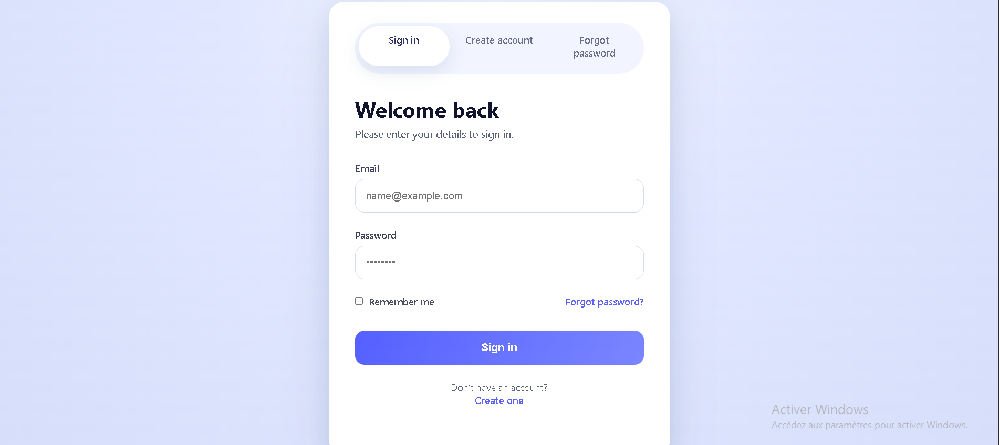

# Modern Authentication Portal

A professional and responsive authentication UI component featuring Sign-in, Sign-up, and Password Reset functionalities.

## Key Features
- **Pure CSS Logic:** Tab switching implemented using CSS radio-button techniques (no JavaScript required for UI state).
- **Responsive Design:** Fully optimized for mobile, tablet, and desktop views.
- **Modern UI/UX:** Clean aesthetics with smooth transitions and subtle shadows.
- **Accessibility:** Semantic HTML tags and ARIA labels for better screen reader support.

## Tech Stack
- **HTML5:** Structured for accessibility and form validation.
- **CSS3:** Advanced flexbox/grid layouts, custom properties (variables), and animations.

## Preview

